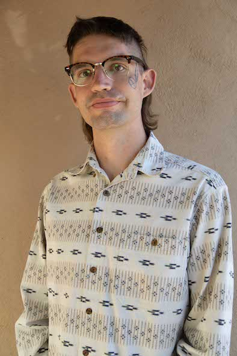

 
    

 <b>Caleb Earl Adams</b>   <em>PhD Student</em> 

I am a second year PhD student in the Department of Earth and Planetary Sciences, Jackson School of Geosciences at the University of Texas at Austin where I am advised by Dr. Ashley M. Matheny and Dr. Dev Niyogi. I'm a recipient of the Department of Energy Computational Science Fellowship and the Donald D. Harrington Fellowship. My research interests are in the use of numerical modeling and other computational methods to study fire and ecohydrology.

